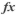

[Project](../../../../../../startpage.md)>[Servers](../../../../../Servers.md)>[system@localhost:49154:xe](../../../../system@localhost_49154_xe.md)>[Schemas](../../../Databases.md)>[SYSTEM](../../SYSTEM.md)>[User Types](../UserTypes.md)>[Table Types](TableTypes.md)>LOGMNR$TAB_GG_RECS


#  LOGMNR$TAB_GG_RECS


## <a name="#Properties"></a>Properties
|Name|Value|
|---|---|
|Status|VALID|
|Owner|SYSTEM|
|Data Type|LOGMNR$TAB_GG_REC|
|Length||
|Precision||
|Scale||
|Type Owner|SYSTEM|
|Type Name|LOGMNR$TAB_GG_REC|
|Type Modification||
|Created|2017. 01. 26. 14:06:54|
|Last Modified|2017. 01. 26. 14:06:54|


## <a name="#SqlScript"></a>SQL Script
```SQL
CREATE TYPE SYSTEM.LOGMNR$TAB_GG_RECS AS
    TABLE OF SYSTEM.LOGMNR$TAB_GG_REC;
/
```

## <a name="#DependsOn"></a>Depends On _`2`_
-  [LOGMNR$TAB_GG_REC](../ObjectTypes/LOGMNR$TAB_GG_REC.md)
-  SYS.STANDARD


## <a name="#UsedBy"></a>Used By _`1`_
-  [LOGMNR$TAB_GG_TABF_PUBLIC](../../Functions/LOGMNR$TAB_GG_TABF_PUBLIC.md)


||||
|---|---|---|
|Author: |Copyright © All Rights Reserved|Created: 10. 04. 2021|
# dbForge Studio 2021 Trial