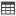

[Project](../../../../../startpage.md)>[Servers](../../../../Servers.md)>[system@localhost:49154:xe](../../../system@localhost_49154_xe.md)>[Schemas](../../Databases.md)>[SYSTEM](../SYSTEM.md)>[Views](Views.md)>MVIEW_EXCEPTIONS


#  MVIEW_EXCEPTIONS

## <a name="#Description"></a>Description
> This view gives DBA access to dimension validation results
## <a name="#Properties"></a>Properties
|Name|Value|
|---|---|
|Editioning|False|
|Status|VALID|
|Oid Text||
|Type Text||
|View Type||
|View Owner|SYSTEM|
|Restrictions||
|Constraint||
|Created|2017. 01. 26. 13:58:49|
|Last Modified|2017. 01. 26. 13:58:49|


## <a name="#Columns"></a>Columns
|Name|Alias|Description|
|---|---|---|
|RUNID|RUNID||
|OWNER|OWNER||
|TABLE_NAME|TABLE_NAME||
|DIMENSION_NAME|DIMENSION_NAME||
|RELATIONSHIP|RELATIONSHIP||
|BAD_ROWID|BAD_ROWID||

## <a name="#SqlScript"></a>SQL Script
```SQL
CREATE VIEW SYSTEM.MVIEW_EXCEPTIONS (
  RUNID,
  OWNER,
  TABLE_NAME,
  DIMENSION_NAME,
  RELATIONSHIP,
  BAD_ROWID
)
AS
  SELECT t1.runid# AS runid,
       owner,
       table_name,
       dimension_name,
       relationship,
       bad_rowid
  FROM MVIEW$_ADV_EXCEPTIONS t1,
       MVIEW$_ADV_LOG t2,
       ALL_USERS u
  WHERE t1.runid# = t2.runid#
    AND u.username = t2.uname
    AND u.user_id = USERENV('SCHEMAID');

COMMENT ON TABLE SYSTEM.MVIEW_EXCEPTIONS IS 'This view gives DBA access to dimension validation results';
```

## <a name="#DependsOn"></a>Depends On _`3`_
-  PUBLIC.ALL_USERS
-  MVIEW$_ADV_EXCEPTIONS
-  MVIEW$_ADV_LOG


## <a name="#UsedBy"></a>Used By
No items found

||||
|---|---|---|
|Author: |Copyright © All Rights Reserved|Created: 10. 04. 2021|
# dbForge Studio 2021 Trial